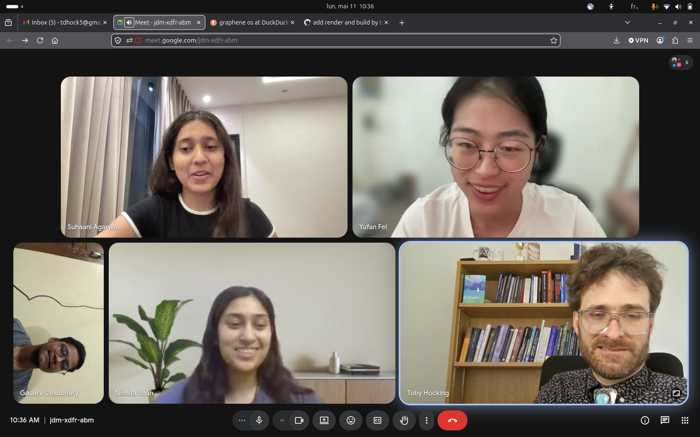

Since its start in 2013, the animint project has been advanced by contributions from people funded by Google Summer Of Code (GSOC).
Now in 2026, the animint project has the pleasure to welcome two new contributors.

Above there is a screenshot from a video call yesterday with the animint GSOC 2026 community:

* [Yufan Fei](https://github.com/Faye-yufan), GSOC contributor 2022–2023, mentor since 2024.
* [Suhaani Agarwal](https://github.com/suhaani-agarwal), GSOC contributor 2025, new mentor this year.
* [Nishita Shah](https://github.com/Nishita-shah1), new GSOC contributor 2026, posting updates in [issue322](https://github.com/animint/animint2/issues/322), and first working on `aes(subgroup)` for drawing holes in polygons, [PR320](https://github.com/animint/animint2/pull/320).
* [Gaurav Chaudhary](https://github.com/ANAMASGARD), new GSOC contributor 2026, plans to first work on fixing CI, [issue324](https://github.com/animint/animint2/issues/324).

Thanks to all of you for your ongoing contributions to the project, and I am looking forward to interacting with you over the summer!
